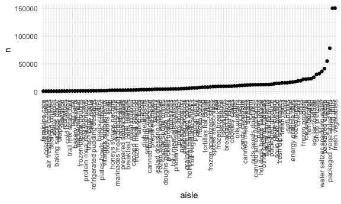
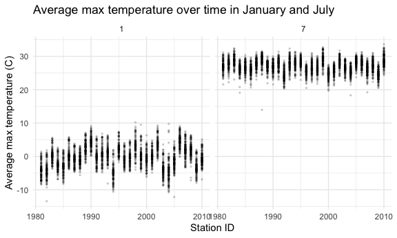
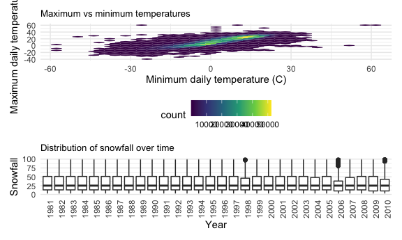

p8105\_hw3\_kl3181
================
Kelley Lou

### Problem 1

Load in dataset.

``` r
data("instacart")
```

This dataset contains 1384617 rows and 15 columns. Observations are the
level of items in orders by user. There are user / order variables –
user ID, order ID, order day, and order hour. There are also item
variables – name, aisle, department, and some numeric codes.

How many aisles and which are most items from?

``` r
instacart %>% 
  count(aisle) %>% 
  arrange(desc(n))
```

    ## # A tibble: 134 x 2
    ##    aisle                              n
    ##    <chr>                          <int>
    ##  1 fresh vegetables              150609
    ##  2 fresh fruits                  150473
    ##  3 packaged vegetables fruits     78493
    ##  4 yogurt                         55240
    ##  5 packaged cheese                41699
    ##  6 water seltzer sparkling water  36617
    ##  7 milk                           32644
    ##  8 chips pretzels                 31269
    ##  9 soy lactosefree                26240
    ## 10 bread                          23635
    ## # … with 124 more rows

Making a plot for number of items ordered in each aisle.

``` r
instacart %>% 
  count(aisle) %>% 
  filter(n > 1000) %>% 
  mutate(
    aisle = factor(aisle),
    aisle = fct_reorder(aisle, n)
  ) %>% 
  ggplot(aes(x = aisle, y = n)) +
  geom_point() +
  theme(axis.text.x = element_text(angle = 90, vjust = 0.5, hjust = 1))
```



Making a plot to show the three most popular items.

``` r
instacart %>% 
  filter(aisle %in% c("baking ingredients", "dog food care", "pacakaged vegetables fruits")) %>% 
  group_by(aisle) %>% 
  count(product_name) %>% 
  mutate(rank = min_rank(desc(n))) %>% 
  filter(rank < 4) %>% 
  arrange(aisle, rank) %>% 
  knitr::kable()
```

| aisle              | product\_name                                 |   n | rank |
| :----------------- | :-------------------------------------------- | --: | ---: |
| baking ingredients | Light Brown Sugar                             | 499 |    1 |
| baking ingredients | Pure Baking Soda                              | 387 |    2 |
| baking ingredients | Cane Sugar                                    | 336 |    3 |
| dog food care      | Snack Sticks Chicken & Rice Recipe Dog Treats |  30 |    1 |
| dog food care      | Organix Chicken & Brown Rice Recipe           |  28 |    2 |
| dog food care      | Small Dog Biscuits                            |  26 |    3 |

Making a table to compare mean hour of the day at which apples and ice
cream are ordered.

``` r
instacart %>% 
  filter(product_name %in% c("Pink Lady Apples", "Coffee Ice Cream")) %>% 
  group_by(product_name, order_dow) %>% 
  summarize(mean_hour = mean(order_hour_of_day)) %>% 
  pivot_wider(
    names_from = order_dow,
    values_from = mean_hour
  )
```

    ## `summarise()` regrouping output by 'product_name' (override with `.groups` argument)

    ## # A tibble: 2 x 8
    ## # Groups:   product_name [2]
    ##   product_name       `0`   `1`   `2`   `3`   `4`   `5`   `6`
    ##   <chr>            <dbl> <dbl> <dbl> <dbl> <dbl> <dbl> <dbl>
    ## 1 Coffee Ice Cream  13.8  14.3  15.4  15.3  15.2  12.3  13.8
    ## 2 Pink Lady Apples  13.4  11.4  11.7  14.2  11.6  12.8  11.9

### Problem 2

##### Load in the dataset and tidy.

``` r
accel_df = 
  read_csv(
    "./accel_data.csv") %>% 
  janitor::clean_names() %>%
  mutate(
    weekday = if_else(day %in% c("Saturday","Sunday"), "Weekend", "Weekday"),
  ) %>% 
  pivot_longer(
    activity_1:activity_1440,
    names_to = "activity",
    values_to = "activity_count"
  ) %>% 
  separate(activity, into = c("activity", "minute")) %>% 
  select(-activity) %>% 
  mutate(
    minute = as.numeric(minute),
    day = as.factor(day),
    day = forcats::fct_relevel(day, c("Sunday", "Monday", "Tuesday", "Wednesday", "Thursday", "Friday", "Saturday"))
  )
```

    ## Parsed with column specification:
    ## cols(
    ##   .default = col_double(),
    ##   day = col_character()
    ## )

    ## See spec(...) for full column specifications.

The resulting dataset has 50400 rows and 6 columns. The columns include
information for a 63 year old male with a BMI of 25, with CHF who wore
an accelerometer for 5 weeks. The data include the week, day of the
week, whether it is a weekday or weekend, minute of the day as well as
the activity count.

##### Creating a total activity variable

``` r
accel_df %>% 
  group_by(week, day) %>% 
  summarize(total_activity = sum(activity_count)) %>% 
  mutate(
    total_activity = round(total_activity, digits = 0)
  ) %>% 
  knitr::kable()
```

    ## `summarise()` regrouping output by 'week' (override with `.groups` argument)

| week | day       | total\_activity |
| ---: | :-------- | --------------: |
|    1 | Sunday    |          631105 |
|    1 | Monday    |           78828 |
|    1 | Tuesday   |          307094 |
|    1 | Wednesday |          340115 |
|    1 | Thursday  |          355924 |
|    1 | Friday    |          480543 |
|    1 | Saturday  |          376254 |
|    2 | Sunday    |          422018 |
|    2 | Monday    |          295431 |
|    2 | Tuesday   |          423245 |
|    2 | Wednesday |          440962 |
|    2 | Thursday  |          474048 |
|    2 | Friday    |          568839 |
|    2 | Saturday  |          607175 |
|    3 | Sunday    |          467052 |
|    3 | Monday    |          685910 |
|    3 | Tuesday   |          381507 |
|    3 | Wednesday |          468869 |
|    3 | Thursday  |          371230 |
|    3 | Friday    |          467420 |
|    3 | Saturday  |          382928 |
|    4 | Sunday    |          260617 |
|    4 | Monday    |          409450 |
|    4 | Tuesday   |          319568 |
|    4 | Wednesday |          434460 |
|    4 | Thursday  |          340291 |
|    4 | Friday    |          154049 |
|    4 | Saturday  |            1440 |
|    5 | Sunday    |          138421 |
|    5 | Monday    |          389080 |
|    5 | Tuesday   |          367824 |
|    5 | Wednesday |          445366 |
|    5 | Thursday  |          549658 |
|    5 | Friday    |          620860 |
|    5 | Saturday  |            1440 |

We can see that there are specifically two days of lower activity,
notably the last two Saturdays in weeks 4 and 5. Similarly, the last two
Sundays also had lower activity than previous weeks.It also looks like
levels of activity are pretty similar for Tuesdays, Wednesdays and
Thursdays with more varying activity for Mondays and Fridays.

##### Now create a plot of 24 hour time activity.

``` r
accel_df %>% 
  ggplot(aes(x = minute, y = activity_count)) +
  geom_line(aes(color = day), alpha = 0.3) +
  scale_x_continuous(
    breaks = c(0, 240, 480, 720, 960, 1200, 1440),
    labels = c("00:00", "4:00", "8:00", "12:00", "16:00", "20:00", "23:59")
  ) +
  labs(
    title = "Activity levels over 24 hours by day of the week",
    x = "Time of day",
    y = "Level of activity"
  )
```


Based on this graphic, we can see that most of the activity is around
1250, with a few days that have heightened activity. For example, there
is more activity on Sunday around 11:00 AM and also more activity in the
evenings on Friday. As expected, there is much less activity in the late
evening and early morning hours.

### Problem 3

##### Load in the dataset.

``` r
data("ny_noaa")
```

This dataset consists of five variables for all New York state weather
stations from January 1, 1981 through December 31, 2010. There are
2595176 rows and 7 columns. Key variables consist of the weather station
ID, observation date, precipitation, snowfall, snow depth, and minimum
and maximum temperatures. However, the weather stations do not collect
all of these variables, and therefore there is a lot of missing data.

##### Tidy the dataset.

``` r
noaa_tidy =
ny_noaa %>% 
  janitor::clean_names() %>% 
  drop_na() %>% 
  separate(date, into = c("year", "month", "day"), sep = "-") %>% 
  mutate(
    year = as.integer(year),
    month = as.integer(month),
    day = as.integer(day),
    tmin = as.numeric(tmin) / 10,
    tmax = as.numeric(tmax) / 10,
    prcp = prcp / 10
  )
```

Finding the most common snowfall observed values.

``` r
noaa_tidy %>% 
  count(snow, name = "n_obs") %>% 
  arrange(desc(n_obs))
```

    ## # A tibble: 248 x 2
    ##     snow   n_obs
    ##    <int>   <int>
    ##  1     0 1112758
    ##  2    25   15809
    ##  3    13   12460
    ##  4    51    9252
    ##  5     5    5669
    ##  6     8    5380
    ##  7    76    5296
    ##  8     3    5276
    ##  9    38    5050
    ## 10   102    3386
    ## # … with 238 more rows

The most common observed value is 0 centimeters of snowfall with 2008508
observations. The most common snowfall is 25 millimieters with 31022. It
is likely these are the most common values because for most days out of
the year there is no snow or some stations are less likely to have snow
than others.

##### Making a two-panel plot to show the average *max* temperature in January and July.

``` r
noaa_tidy %>%
  group_by(id, year, month) %>%  
  summarize(average_max_temp = mean(tmax)) %>% 
  filter(month %in% c("1", "7")) %>% 
  ggplot(aes(x = id, y = average_max_temp, color = year)) +
  geom_point(alpha = 0.5, size = 0.5) +
  facet_grid(. ~ month) +
  labs(
    title = "Average max temperature over time in January and July",
    x = "Station ID",
    y = "Average max temperature (C)")
```

    ## `summarise()` regrouping output by 'id', 'year' (override with `.groups` argument)


Looking at the average maximum temperature across the stations, we can
see that the maximum temperatures are definitely higher for all the
stations in July compared to January. Additionally, There are a few
stations where it looks like the maximum temperature difference is
greater for certain stations. Over time, it looks like temperatures are
fairly consistent, however there seems to be more variation as time goes
on.

##### Making a two-panel plot for tmax and tmin for full dataset.

``` r
library(patchwork)

temperature_p = 
  noaa_tidy %>% 
  ggplot(aes(x = tmax, y = tmin)) +
  geom_hex() +
  labs(
    title = "Maximum vs minimum temperatures"
  ) +
  theme(plot.title = element_text(size = 10))

snow_p = 
  noaa_tidy %>% 
  filter(snow > 0, snow < 100) %>% 
  ggplot(aes(x = year, y = snow)) +
  geom_violin() +
  labs(
    title = "Distribution of snowfall over time"
  ) +
  theme(plot.title = element_text(size = 10))  

temperature_p + snow_p
```


